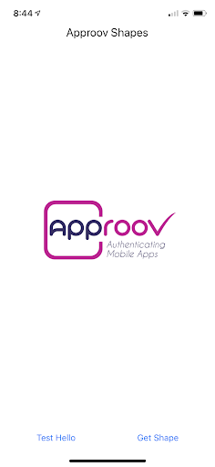
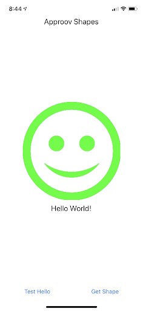
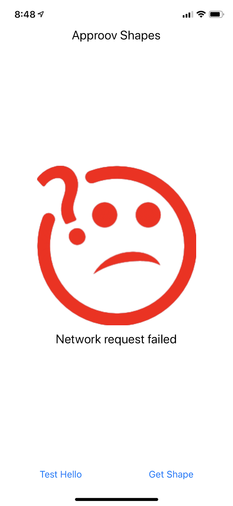
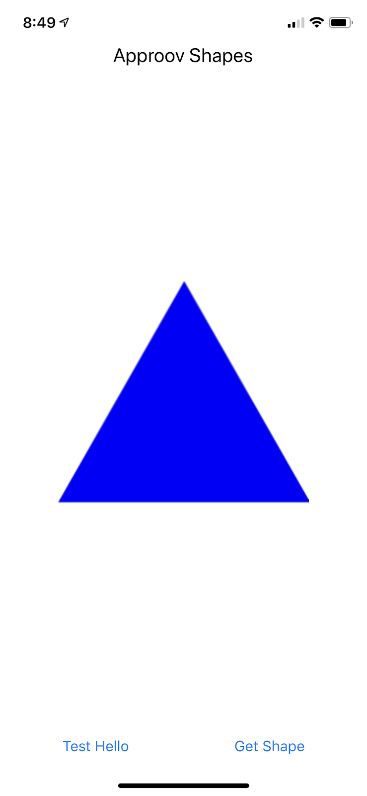
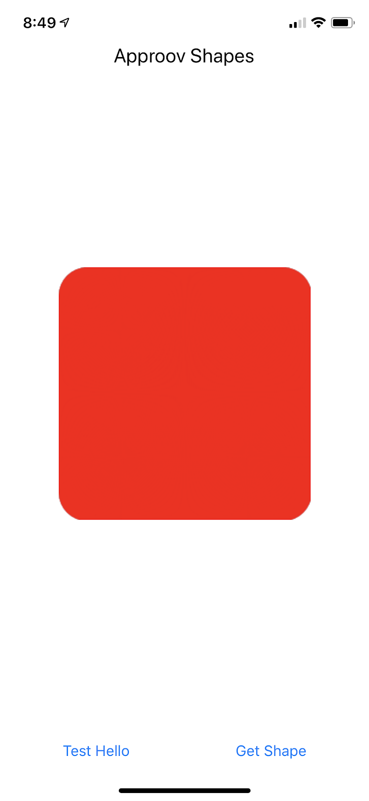
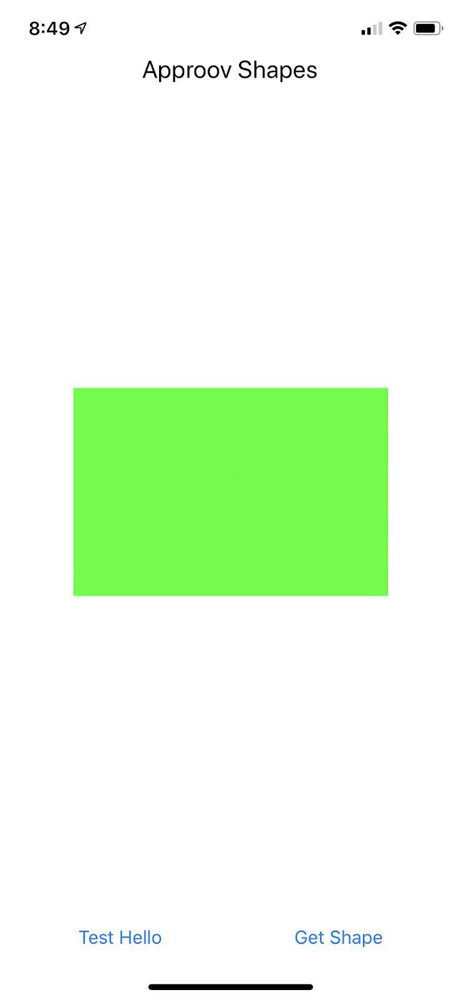
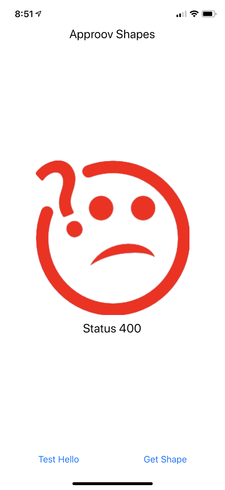

# Approov Quickstart: React Native

This quickstart is written specifically for native Android and iOS apps that are written using [`React Native`](https://[square.github.io/retrofit/]). If this is not your situation then check if there is a more relevant Quickstart guide available.

## WHAT YOU WILL NEED
* Access to either a demo or trial Approov account
* The `approov` command line tool [installed](https://approov.io/docs/latest/approov-installation/) with `APPROOV_MANAGEMENT_TOKEN` set with your account access token
* The contents of the folder containing this README

## WHAT YOU WILL LEARN
* How to integrate Approov into a real app in a step by step fashion
* How to register your app to get valid tokens from Approov
* A solid understanding of how to integrate Approov into your own app that uses [`React Native`](https://[square.github.io/retrofit/]
* Some pointers to other Approov features

## RUNNING THE SHAPES APP WITHOUT APPROOV

The Shapes App is a simple React Native application written in Javascript using the React and [React Native frameworks](https://facebook.github.io/react-native/) provided by Facebook.



The application consists mostly of boilerplate code, apart from the definitions of the shapes server’s URLs and setting up of the `onPress` callback for each of the buttons along the bottom of the screen.

The _Test Hello_ and _Get Shape_ buttons set up API requests to the shapes server, using the application’s built-in [Fetch API networking facility](https://facebook.github.io/react-native/docs/network). For example, the _Test Hello_ button initiates a `GET` request to the `shapes.approov.io/v1/hello` endpoint.

React Native apps commonly use other networking frameworks built on top of the Fetch API to add additional functionality, for example, [Axios](https://www.npmjs.com/package/axios) and [Frisbee](https://www.npmjs.com/package/frisbee).

On a successful _hello_ request to `/v1/hello`, the client app will say hello with a smile, while a failure or unsuccessful response will return a frown with some explanation of the error. The purpose of this simple endpoint is really just to test connectivity and to verify that you have built, installed and run the demo app correctly.

<a>
    
</a>

<a>
    
</a>

A successful _shapes_ request to `/v1/shapes` returns one of four possible shapes:

<a>
    
</a>

<a>
    
</a>

<a>
    
</a>

<a>
    
</a>

To build the React Native Shapes app, first ensure you have the `yarn` package manager installed for your system (see the instructions for your specific OS [here](https://yarnpkg.com/lang/en/docs/install/)). Also make sure your system is set up for React Native development by following their [Getting Started](https://facebook.github.io/react-native/docs/getting-started) instructions.

Open a shell terminal at `react-native-approov/src/ShapesApp` and type:

```
$ yarn install
```

Start the [Metro](https://facebook.github.io/metro/) server with:

```
$ react-native start
```

Then, to run on an Android Emulator (which must already be launched), open another terminal window and type:

```
$ react-native run-android
```

Or to run on an iOS Simulator, type:

```
$ react-native run-ios
```

It is also possible to run the app on a real device by passing the `--device` flag to the react-native commands above. For more information, see React Native’s [running on a device](https://facebook.github.io/react-native/docs/running-on-device) documentation.

Now grab a shape and enjoy the endless family fun!


## ADDING APPROOV SUPPORT

### Add the Latest Approov SDK

Currently, the underlying Approov SDK itself is not shipped as part of the `react-native-approov` module. You need to get the latest version. For the Android version do the following (if you are using Windows then substitute `approov` with `approov.exe` in all cases in this quickstart)
```
$ approov sdk -getLibrary src/react-native-approov/android/libs/approov.aar
```
This directly gets the SDK into the native module.

For iOS, do the following:
```
$ cd src/react-native-approov/ios
$ approov sdk -getLibrary approov.zip
$ unzip approov.zip
```
This will write the Approov SDK framework into `Approov.framework` in that directory.

### Require the Approov React Native Package

Edit `src/ShapesApp/packages.json` and add this dependency:

```
"react-native-approov": "../react-native-approov/"
```

From `src/ShapesApp/` folder run:

```
$ cd src/ShapesApp && yarn install
```

### Add Approov Native Module

Approov protection is provided through the `react-native-approov` module for both Android and iOS mobile platforms. This is an [NPM](https://www.npmjs.com) React Native [module](https://facebook.github.io/react-native/docs/native-modules-setup) which exposes the native Approov functionality to Javascript for your app to access, while hiding a lot of the complexity so you can enjoy the benefits of API protection without the fuss.

Install the Approov module as an app dependency. From the command line at the directory `react-native-approov/src/ShapesApp` type:

```
$ yarn add ../react-native-approov
```

### Install Approov Token Fetch Javascript

Install an example Approov HTTP support file (provided in the `react-native-approov` module’s `support-files` directory). From the command line at the directory `react-native-approov/src/ShapesApp` type:

```
$ yarn --cwd node_modules/react-native-approov install-fetch-support-file $PWD/src
```

where `$PWD` should be the current directory at `react-native-approov/src/ShapesApp`.

This will copy the file `ApproovFetchSupport.js` to the ShapesApp directory at `react-native-approov/src/ShapesApp/src/`. You can read more about how this later works in the `FETCH-CODE_DETAIL.md` file.

### Enable Approov Support in the App

In the javascript source file `react-native-approov/src/ShapesApp/src/App.js` find the location marked with a comment:

```
*** UNCOMMENT THE SECTION BELOW FOR APPROOV ***
```

In order to enable Approov support in the Shapes app, this block of code must be uncommented. Specifically, the code imports a version of HTTP ‘fetch’ with Approov support which can be used for fetch() calls when making API requests from your app.

Approov also permits specifying the name of an existing HTTP header whose value will be bound to an Approov token for additional protection. In this example, we bind the user’s Authorization Bearer token to the Approov token so that the issued Approov token is only valid for a particular user. This effectively combines both app _and_ user authentication for rock solid API protection!

```
// *** UNCOMMENT THE SECTION BELOW FOR APPROOV ***
import approovFetch from './ApproovFetchSupport';
approovFetch.tokenBindingHeader = 'Authorization';
this.fetch = approovFetch;
```

### Select the Correct Shapes Endpoint
The Shapes server provides the app with shapes using multiple versions of an API: version 1 (https://shapes.approov.io/v1/shapes) which is _not_ protected by Approov, and version 2 (https://shapes.approov.io/v2/shapes) which _is_ protected by Approov.

Now that we’re using Approov, let’s switch to use version 2 of the Shapes API. In App.js (`react-native-approov/src/ShapesApp/src/App.js`), find the line of code:

`const API_VERSION = 'v1';`

and change it to

`const API_VERSION = 'v2';`

### Ensure the Shapes API is Added

In order for Approov tokens to be generated for `https://shapes.approov.io/v2/shapes` it is necessary to inform Approov about it. If you are using a demo account this is unnecessary as it is already setup. For a trial account do:
```
$ approov api -add shapes.approov.io
```
Tokens for this domain will be automatically signed with the specific secret for this domain, rather than the normal one for your account.

### Setup an Initial Approov Configuration

An Approov-enabled app requires a [configuration file](https://approov.io/docs/latest/approov-usage-documentation/#sdk-configuration) to initialize it. The Approov configuration is updated dynamically after subsequent launches of the app. Use the approov command-line tool in a shell to fetch a configuration file:

```
$ approov sdk -getConfig approov-initial.config
```

On success, the tool reports:

```
initial SDK configuration written to approov-initial.config
```

Copy the configuration file, `approov-initial.config`, to the root ShapesApp project directory (`react-native-approov/src/ShapesApp/approov-initial.config`). From the command line at the directory `react-native-approov/src/ShapesApp` type:

```
$ yarn run install-approov-config
```

This command (specified in `package.json`) simply copies the `approov-initial.config` file to the relevant locations for Android and iOS (`react-native-approov/src/ShapesApp/android/app/src/main/assets/` for Android and `react-native-approov/src/ShapesApp/ios/ShapesApp/ `for iOS).

Note that if you are integrating Approov into your own app then this command may not be available and you should add it. It needs to copy the `approov-initial.config` file into `react-native-approov/android/app/src/main/assets/` and `react-native-approov/ios/ShapesApp/`.

Build and run the app on your preferred platform.

Note that on iOS you must run the command `pod install` in the Shapes app `ios` directory first as React Native iOS is built using the [CocoaPods](https://cocoapods.org) dependency framework.

You should see in the [metro](https://facebook.github.io/metro/) log that Approov is successfully fetching tokens, but the Shapes API is not returning valid shapes:

<p>
    
</p>

Warning: Never log tokens in a released app as this could permit hackers to harvest data from your API while the token has not expired! Always use _[loggable](https://www.approov.io/docs/latest/approov-usage-documentation/#loggable-tokens)_ Approov tokens for debugging.

## REGISTER YOUR APP WITH APPROOV

Although the application is now receiving and forwarding tokens with your API calls, the tokens are not yet properly signed, because the attestation service does not recognize your application. Once you register the app with the Approov service, untampered apps will attest successfully and begin to fetch and transmit valid tokens.

Approov command line tools are provided for Windows, MacOS, and Linux platforms. Select the proper operating system executable. In a shell in your `react-native-approov/src/ShapesApp` directory (this assumes that the `approov` tool is in your `PATH` and that you saved the demo management token in a file called `development.tok` in the same directory that contains the `react-native-approov` directory):

### Android

```
$ approov registration -add android/app/build/outputs/apk/debug/app-debug.apk
```

### iOS

Open the Xcode project located in src/ShapesApp/ios/ShapesApp.xcodeproj and select your code signing certificate in the Signing & Capabilities section of the project.
Build the Shapes app for an iOS device_ (required for Approov support)_ using:

```
$ react-native run-ios --device
```

The generate an IPA package for iOS at the directory `react-native-approov/src/ShapesApp` using:

```
$ yarn run create-ipa
```

(command specified in `package.json`)

Then finally, run the app registration command:

```
$ approov registration -add Payload.ipa
```

If you plan to submit your application to the app store, you must remove the Intel CPU simulator support architectures from the Approov binary before submitting your app. To do so, at the directory `react-native-approov/src/ShapesApp/node_modules/react-native-approov/ios/Approov.framework` using the command line:

```
lipo Approov -remove i386 -output Approov
lipo Approov -remove x86_64 -output Approov
```

Since executing the above commands will disable support for the iOS Simulator, you may wish to keep a copy of the Approov framework or download another copy if a Simulator run is required.

## RUNNING THE SHAPES APP WITH APPROOV

Wait for the registration to propagate to the Approov service. This could take up to 30 seconds. Then restart your application to flush out any bad tokens, tap _Get Shape_ and you should see:

<p>
    
</p>

or any of the four possible shapes returned by the server. Congratulations, your API is now Approoved!

## WHAT IF I DON'T GET SHAPES

If you still don't get a valid shape then there are some things you can try. Remember this may be because the device you are using has some characteristics that cause rejection for the currently set [Security Policy](https://approov.io/docs/latest/approov-usage-documentation/#security-policies) on your account:

* Ensure that the version of the app you are running is exactly the one you registered with Approov.
* If you running the app from a debugger then valid tokens are not issued.
* Approov token data is logged to the console using a secure mechanism - that is, a _loggable_ version of the token is logged, rather than the _actual_ token for debug purposes. This is covered [here](https://www.approov.io/docs/latest/approov-usage-documentation/#loggable-tokens). The code which performs this is:

```
const result = await Approov.fetchApproovToken(url);
console.log("Fetched Approov token: " + result.loggableToken);
```

and the logged token is specified in the variable `result.loggableToken`.

The Approov token format (discussed [here](https://www.approov.io/docs/latest/approov-usage-documentation/#token-format)) includes an `anno` claim which can tell you why a particular Approov token is invalid and your app is not correctly authenticated with the Approov Cloud Service. The various forms of annotations are described [here](https://www.approov.io/docs/latest/approov-usage-documentation/#annotation-results).

If you have a trial (as opposed to demo) account you have some additional options:
* Consider using an [Annotation Policy](https://approov.io/docs/latest/approov-usage-documentation/#annotation-policies) during development to directly see why the device is not being issued with a valid token.
* Use `approov metrics` to see [Live Metrics](https://approov.io/docs/latest/approov-usage-documentation/#live-metrics) of the cause of failure.
* You can use a debugger and get valid Approov tokens on a specific device by [whitelisting](https://approov.io/docs/latest/approov-usage-documentation/#adding-a-device-security-policy).

## USING AXIOS NETWORKING

If you use the [Axios](https://www.npmjs.com/package/axios) networking library in your React Native application, you can add Approov tokens to request headers and various other required handlers using the Axios request/response interceptor mechanism. An Axios Approov support file (similar to `ApproovFetchSupport.js`) is provided in the React Native Approov module’s `support-files` directory and can be installed in your app by running:

```
$ yarn --cwd node_modules/react-native-approov install-axios-support-file $PWD/src
```

where `$PWD` should be the current directory at `react-native-approov/src/ShapesApp`.

This will copy the file `ApproovAxiosSupport.js` to the ShapesApp directory at `react-native-approov/src/ShapesApp/src/`.

It’s basic usage (also shown in the source file) is:

```
import axios from 'axios';
import approovAxiosInterceptor from './ApproovAxiosSupport';

const axiosInstance = axios.create();
axiosInstance.interceptors.request.use(approovAxiosInterceptor.requestFulfilled);
axiosInstance.interceptors.response.use(null, approovAxiosInterceptor.responseRejected);
```

## USING TOKEN BINDING

It is possible to bind the value of a named HTTP request header to an Approov token (since Approov tokens can include the hash of an arbitrary data string) which can then be validated by your API.

To bind a named header, simply set the `tokenBindingHeader` variable specified in the Approov Fetch Support file (`react-native-approov/src/ShapesApp/src/ApproovFetchSupport.js`) to the name of an _existing_ HTTP request header:

```
import approovFetch from './ApproovFetchSupport';
approovFetch.tokenBindingHeader = 'Authorization';
```

This header must have a value by the time the API request is initiated by calling `fetch()`.

See the Approov [Token Binding](https://www.approov.io/docs/latest/approov-usage-documentation/#backend-integration-impact) documentation for instructions on how to configure your own API with the capability of verifying Approov tokens which include a request header value hash in the JWT `pay` claim.

A common usage for this ‘token binding header’ feature is to bind a user’s login token (often an [OAuth2](https://oauth.net/2/) access token), typically specified in the `Authorization` header, to an Approov token thus combining both _user_ authentication and _app_ authentication for an optimal API protection solution. This way only the current authorized user can make API calls from this authenticated app.

In the Shapes v2 API, if the backend service finds a `pay` claim in the Approov token, it looks for an authorization bearer token in the request’s `Authorization` header. If one is found, the backend service will verify that the bearer token’s hash matches the Approov token’s `pay` claim. If the bearer token is not found, the backend service rejects the request.

## NEXT STEPS

This quick start guide has shown you how to integrate Approov with your existing app. Now you might want to explore some other Approov features:

* Managing your app [registrations](https://approov.io/docs/latest/approov-usage-documentation/#managing-registrations)
* Manage the [pins](https://approov.io/docs/latest/approov-usage-documentation/#public-key-pinning-configuration) on the API domains to ensure that no Man-in-the-Middle attacks on your app's communication are possible.
* Update your [Security Policy](https://approov.io/docs/latest/approov-usage-documentation/#security-policies) that determines the conditions under which an app will be given a valid Approov token.
* Learn how to [Manage Devices](https://approov.io/docs/latest/approov-usage-documentation/#managing-devices) that allows you to change the policies on specific devices.
* Understand how to issue and revoke your own [Management Tokens](https://approov.io/docs/latest/approov-usage-documentation/#management-tokens) to control access to your Approov account.
* Use the [Metrics Graphs](https://approov.io/docs/latest/approov-usage-documentation/#metrics-graphs) to see live and accumulated metrics of devices using your account and any reasons for devices being rejected and not being provided with valid Approov tokens. You can also see your billing usage which is based on the total number of unique devices using your account each month.
* Use [Service Monitoring](https://approov.io/docs/latest/approov-usage-documentation/#service-monitoring) emails to receive monthly (or, optionally, daily) summaries of your Approov usage.
* Investigate other advanced features, such as [Offline Security Mode](https://approov.io/docs/latest/approov-usage-documentation/#offline-security-mode), [DeviceCheck Integration](https://approov.io/docs/latest/approov-usage-documentation/#apple-devicecheck-integration) and [Android Automated Launch Detection](https://approov.io/docs/latest/approov-usage-documentation/#android-automated-launch-detection).
