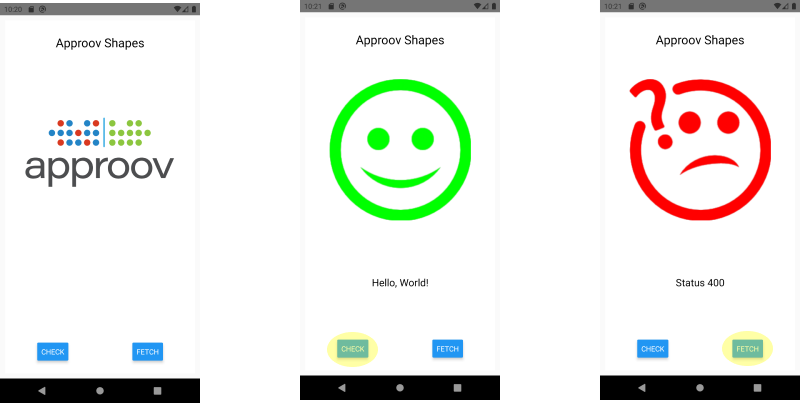

<h1 align="center">React-Native Approov Quickstart</h1>
<h2 align="center" style="color:red;">WARNING: THIS PACKAGE IS PRE-RELEASE ONLY</h2>
<p align="center">
    <a href="https://approov.io">
      
    </a>
    <a href="https://www.npmjs.com/package/@approov/react-native-approov">
      
    </a>
    <a href="https://github.com/approov/quickstart-react-native/issues?q=is%3Aopen+is%3Aissue">
      
    </a>
    <a href="https://approov.io/docs">
      
    </a>
    <a href="https://reactnative.dev">
      
    </a>
</p>
<p align="center">
  <a href="#basic-usage">Usage</a> •
  <a href="#requirements-and-setup">Requirements</a> •
  <a href="#approov-integration">Approov Integration</a> •
  <a href="#common-scenarios">Common Scenarios</a> •
  <a href="#release-notes">Release Notes</a>
</p>

---

The React Native Approov Quickstart provides an easy integration of Approov API threat protection into most React Native apps.

You will learn how to:

- Check that your React Native app meets the minimum requirements for Approov integration,
- Integrate Approov into your app,
- Register and successfully deploy your app onto Android and iOS devices.

Start with your own React Native app or try one of the available examples.

## Basic Usage

### 0. Check that your development environment is properly set up

Ensure that you have a recent version (>= 0.60) of `React-Native` installed (see [installing react native](https://reactnative.dev/docs/environment-setup)). You also need `yarn` classic (1.x) (see [installing yarn](https://www.npmjs.com/package/yarn). If you can build the default `react-native init` app, you are all set for Android. For iOS, you should also install `ios-deploy` to run on iOS devices (see [installing ios-deploy](https://github.com/ios-control/ios-deploy)).

For Approov, make sure you have installed and can run the `approov` CLI tool (see [installing Approov](https://approov.io/docs/latest/approov-installation/)). If you do not have access to Approov, you can sign up for a free trial at [https://www.approov.io/signup](https://www.approov.io/signup).

Refer to [development requirements and set up](#requirements-and-setup) for additional detail.

### 1. Start with a working React Native app

You can use any React Native app using the standard (non-expo) runtime and standard react-native networking (fetch, axios, or frisbee for example).
Start with your own React Native app, or use one of the Approov-provideed examples.

We will use the Approov `shapes_fetch` example to illustrate the remaining steps to integrate Approov into a simple React Native app. To copy an example, start a command-line terminal, run the react-native-approov, and select an example and directory to install into:

```
$ npx @approov/react-native-approov example
✔ Select example app to copy › shapes_fetch
✔ Specify destination path … .
✔ Created shapes-fetch example.
ℹ Installing shapes-fetch npm dependencies...```
```

The example react-native project is downloadede, npm packages are installed, and on iOS, pod dependencies are also installed. The output is elided for clarity.

To test the app on Android, change into the `shapes_fetch` directory and run android:

```
$ cd shapes_fetch
$ react-native run-android
```

Or to test the app on iOS, change into the example directory and run iOS:

```
$ cd shapes_fetch
$ react-native run-ios
```

You should see a running Approov Shapes app on either an Android emulator or iOS simulator. This is a plain React Native app; Approov is not installed.

There are two buttons on the app. Pressing `check` will call the `shapes.approov.io`server's unprotected hello endpoint  `/v2/hello`, and this should succeed. The `shape` button requests a random shape from the Approov-protected `/v2/shapes` endpoint. This should not succeed because the API call is being made from an App not recognized by Approov.

Here are the Shapes start up, successful hello API call, and unsuccessful shapes API call screens:



### 2. Integrate Approov into the app

Next, we'll run the `react-native-approov check` command to see if the app is ready for Approov integration.

Here's a sample Android check:

```
$ npx @approov/react-native-approov check
   
✔ Found project.json in /Users/skiph/projects/quickrn/play/shapes_fetch.
✔ Found yarn in PATH.
✔ Found React Native version 0.64.0.
✔ Found Approov CLI with active session.
ℹ Approov is currently protecting these API domains:
ℹ   approov.io
ℹ   shapes.approov.io
ℹ   shipfast.skiph.approov.io
ℹ   test.maplerise.com
ℹ To add or remove API domains, see https://approov.io/docs/latest/approov-usage-documentation/#managing-api-domains
ℹ The @approov/react-native-approov package is not installed
✔ Found Android project.
✔ Found Android minimum SDK 21.
✔ Found required Android network permissions.
✔ Found iOS project.
✔ Found iOS workspace - shapes_fetch
✔ Found iOS deployment target 10.0.
   
✔ Approov check completed successfully
```

Watch for a few things:

1. The check requires an active Approov session. See [Establishing an active Approov session](#establishing-an-active-approov-session) if you see a missing Approov session error.

2. Once you have an active Approov session, the check command will show API domains registered to your account with Approov. Make sure all API domains your app should be protecting are registered with Approov. In our shapes example, all `shapes.approov.io` endpoint will be protected. In case you are wondering, although the '/hello' endpoint is protected by Approov, the shapes server chooses to respond to any 'hello' API calls whether the caller appears valid or not.

3. Fix any errors reported by the `check` command. Approov often requires a few version updates or extra permissions. On Android, for example, the minimum SDK is 21, and the additional `ACCESS_NETWORK_STATE` permission is required. Look up the errors in the [common scenarios](#common-scenarios) or follow help links in the command output.

Once all issues are fixed, you should rerun your app to verify it is working. You are ready to integrate Approov.

Run the `react-native-approov integrate` command. It will prompt you to make some choices such as the name of the Approov header field and whether to bind authorization and approov tokens. Some of these values require coordination with your backend service. Refer to the [react-native-approov integrate command](#react-native-approov-integrate) for all options.

In our shapes example, just accept all the default options.

```
$ npx @approov/react-native-approov integrate
   
✔ Found project.json in /Users/skiph/projects/rn-quickstart/playground/tmp/shapes_fetch.
✔ Using Approov version 2.6.
✔ Found React Native version 0.63.4.
✔ Found active Approov CLI.
ℹ Approov is currently protecting these API domains:
ℹ   approov.io                 type:account, alg:HS256
ℹ   shapes.approov.io          type:restricted, alg:HS256
ℹ To add or remove API domains, see https://github.com/approov/quickstart-react-native/blob/master/README.md#approov-api-domains.
✔ Specify Approov token header name … Approov-Token
✔ Specify prefix to add to the Approov token string, if any … 
✔ Specify binding header data name, if any … 
✔ Start token prefetch during app launch? … no / yes
  Installing the @approov/react-native-approov package...
yarn add v1.22.5
[1/4] Resolving packages...
✔ Installed @approov/react-native-approov package
  Installing Android Approov SDK library...
Android SDK library 2.6.0(3534) written to /Users/skiph/projects/rn-quickstart/playground/tmp/shapes_fetch/node_modules/@approov/react-native-approov/android/libs/approov.aar
✔ Installed Android Approov SDK library.
  Installing Android Approov config file...
initial SDK configuration written to /Users/skiph/projects/rn-quickstart/playground/tmp/shapes_fetch/android/app/src/main/assets/approov.config
✔ Installed Android Approov config file.
✔ Installed Android Approov props file.
  Installing iOS Approov SDK library...
approov sdk -libraryID 5851 -getLibrary /Users/skiph/projects/rn-quickstart/playground/tmp/shapes_fetch/node_modules/@approov/react-native-approov/ios/Approov.zip
iOS device SDK library 2.6.0(5851) written to /Users/skiph/projects/rn-quickstart/playground/tmp/shapes_fetch/node_modules/@approov/react-native-approov/ios/Approov.zip
Archive:  /Users/skiph/projects/rn-quickstart/playground/tmp/shapes_fetch/node_modules/@approov/react-native-approov/ios/Approov.zip
✔ Installed iOS Approov SDK library.
  Installing iOS Approov config file...
initial SDK configuration written to /Users/skiph/projects/rn-quickstart/playground/tmp/shapes_fetch/node_modules/@approov/react-native-approov/ios/approov.config
✔ Installed iOS Approov config file.
✔ Installed iOS Approov props file.
  Updating iOS pods...
Auto-linking React Native module for target `shapes_fetch`: react-native-approov
Analyzing dependencies
Downloading dependencies
Generating Pods project
Integrating client project
Pod installation complete! There are 29 dependencies from the Podfile and 28 total pods installed.
✔ Updated iOS pods.
   
✔ Integration completed successfully
```

The newly integrated apps will run on an Android emulator or an iOS simulator, but default security policies require API calls to be made from real devices, so even though Approov is properly integrated, APi calls will still fail. Refer to [Running on an Android emulator]() or [Running on an iOS simulator] for instructions on how to workaround this. 

For our example, we will switch to physical devices to complete and check that Approov is truly protecting our API calls. Because of differences between Android and iOS, the instructions diverge.

#### Android Devices

And once that's completed, rerun android:

```
$ react-native run-android
```

You will see that Approov is now installed, but the API calls are failing because Approov is not registered.

You can view approov-relevant logging info using logcat, similar to this:

```
$ adb logcat | grep -i approov
```

The `react-native-approov` package adds a debug registration command `reg-android` to the react native cli.
Register your app, wait 30 seconds or so, and rerun your app:

```
$react-native reg-android
yarn run v1.22.5
$ /Users/skiph/projects/rn-quickstart/playground/shapes-fetch/node_modules/.bin/react-native reg-android
✔ Found Approov CLI.
✔ Found Approov management token.
✔ Registered debug app for 1h:
registering app Shapes
0ryxGWdWRXGcFJO26vqV9dJzU5Fo/XZ81ccF9ihK9mg=com.shapes-1.0[1]-2974  SDK:Android(2.5.0)
registration successful, expires 2020-12-31 00:59:04
✨  Done in 4.76s.
$ // wait 30 seconds...
$ yarn react-native run-android
```

You should now see your react native app, protected by Approov, successfully making API calls.

If the app is still blocking API calls, you can relaunch the app pr wait 5 minutes for new tokens to be issued.

#### iOS Devices

On iOS, Approov only attests successfully when running on a physical device and not using the interactive packager. So, on iOS, plug in a device and do:

```
$ react-native run-ios --device
```

to build and run your app on a device. Then register the iOS device app by:

```
$ react-native reg-ios
```

Finally, to run your app on a device without the packager, do:

```
$ react-native deploy-ios
```

This will install the app on your device. Launch the app, and Approov should be protecting APi calls from the app.

## Requirements and Setup

### Development Environment

The `react-native-approov` command line tools use `node`, `npx` and `yarn`. `npx` is installed with your `node` environment. Please ensure that `yarn 1 (classic)` is installed. See [https://www.npmjs.com/package/yarn](https://www.npmjs.com/package/yarn).

Follow the recommended React Native setup for your host OS and target platform at [https://reactnative.dev/docs/environment-setup](https://reactnative.dev/docs/environment-setup). React Native should be at version 0.60; the latest version is recommended.

For Android, no additional tooling is required.

For iOS, the `ios-deploy` command is required to deploy app archives onto iOS devices. TYpically, this utility can be installed using `brew install ios-deploy`. See [https://github.com/ios-control/ios-deploy](https://github.com/ios-control/ios-deploy) for more information.

### App Requirements

#### Javascript

XHR compliant network calls

currently no explicit expo support

#### Android

using normal app setup (cra compatible)

minsdk requirements

network permissions

#### iOS

normal workspace structure (cra compatible)

scheme matches workspace name

flipper not supported - disable

signing and provisioning set for device operation

if bitcode required, enabled in workspace

### Approov Requirements

As mentioned elsewhere...

Active Approov Account

sign up for free trial here

CLI Access w/ developer permissions

Enabled using roles or management tokens

Approov API Domains set by admin

set independently; requires admin privileges

## Approov Integration

### React-Native-Approov Commands

all run by npx @approov... or after APproov package installed, using yarn run ...

#### react-native-approov example

#### react-native-approov check

checks requirements are met

#### react-native-approov integrate

properties

bitcode (ios only)

### React-Native Plugin Commands

extend the basic react-native commands

#### reg-android
#### reg-ios
#### deploy-ios

### Manual Integration

WHy? if your project has unusual structure or wish to make changes without running a full reintegration

#### Install Approov package

#### Install Android files

#### Install iOS files

## Common Scenarios

### Establishing an active Approov session

### Checking and Updating Approov-protected API domains

### Updating Android min SDK

### Updating Android Network Permissions

### Running in an Android Emulator

### Disabling Flipper on iOS

### Running on an iOS simulator

### Running on an iOS device

### Using Bitcode with iOS

### Customizing Approov Token Passing

### Prefetching an Approov Token at Launch

### Binding Authorization to Approov Tokens

### Which Javascript Network Libraries are supported?

### Handling Network Errors

### Why apps launched with run-ios apps fail to attest properly

### Next Steps with Approov

### Troubleshooting Approov Rejections

(what if I don't get shapes)

### Contact Support

submit an issue (bugs or feature requests)

ask a question

getting access to approov

## Release Notes

### Version 1.x

### Version 2.x

### Feature Requests

### License

---
