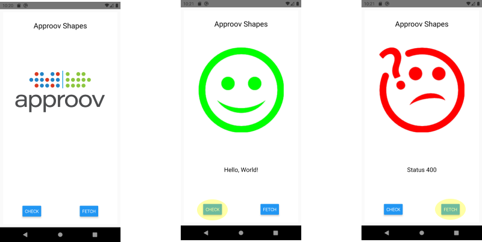
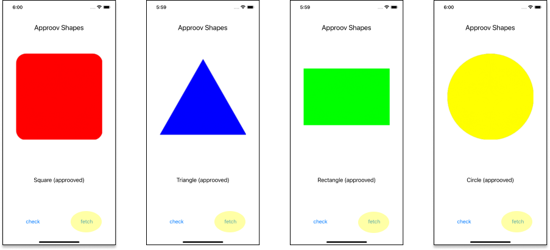
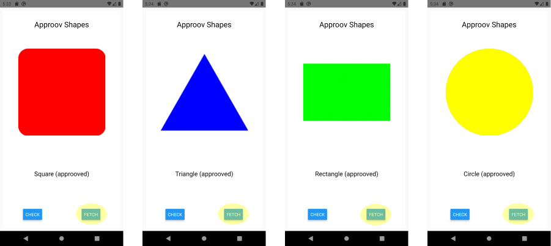

# Shapes Example

This quickstart is written specifically for Android and iOS apps that are implemented using [`React Native`](https://reactnative.dev). This quickstart provides a detailed step-by-step example of integrating Approov into an app using a simple `Shapes` example that shows a geometric shape based on a request to an API backend that can be protected with Approov.

## WHAT YOU WILL NEED
* Access to a trial or paid Approov account
* A recent version of `React Native` (>= 0.60) installed, see [installing react native](https://reactnative.dev/docs/environment-setup).
* You also need `yarn` classic (1.x), see [installing yarn](https://www.npmjs.com/package/yarn).
* The `approov` command line tool [installed](https://approov.io/docs/latest/approov-installation/) with access to your account
* [Android Studio](https://developer.android.com/studio) installed (version Bumblebee 2021.1 is used in this guide) if you will build the Android app. Note that the `ANDROID_SDK_ROOT` value must be properly defined to allow building.
* [Xcode](https://developer.apple.com/xcode/) installed (version 14.1 is used in this guide) to build iOS version of application
* [Cocoapods](https://cocoapods.org) installed to support iOS building (1.11.3 used in this guide)
* An iOS device or simulator if you are using the iOS platform
* An Android device or emulator if you are using the Android platform
* The content of this repo

## RUNNING THE SHAPES APP WITHOUT APPROOV

Firstly, we need to add the Shapes example itself. Three examples: `shapes_axios`, `shapes_fetch`, and `shapes_frisbee` all work with a publicly available shapes service at `shapes.approov.io`.

We will use the Approov `shapes_fetch` example to illustrate the remaining steps to integrate Approov into a simple React Native app. To copy a pre-packaged example, start a command-line terminal, run the `react-native-approov example` command:

```
npx @approov/react-native-approov example
```

Then select an example and directory to install into:

```
✔ Select example app to copy › shapes_fetch
✔ Specify destination path … .
✔ Created shapes-fetch example.
ℹ Installing shapes-fetch npm dependencies...

...

✔ Example shapes_fetch is installed.
```

The example react-native project is downloaded, npm packages are installed, and, on iOS, pod dependencies are also installed. The above output was elided for brevity.

Depending on your platform, before building your app, you may need to explicitly start the metro packager in the top-level React Native project directory as well as starting an emulator/simulator or connecting a physical device. Ensure you are in the `shapes_fetch` and execute:

```
yarn run react-native start
```

### Android

If you wish to run on a physical Android device then connect it to your host platform over USB. See [Run apps on a hardware device](https://developer.android.com/studio/run/device) for full instructions. Use `adb devices` to verify that this device is connected and no other device or emulator is running.

To actually run the app on an Android emulator or device, in a separate process or terminal window, ensure you are in the `shapes_fetch` directory and run android:

```
yarn run react-native run-android
```

### iOS

To test the app on the iOS simulator, run it from the same `shapes_fetch` directory:

```
yarn run react-native run-ios
```

If you obtain an error about `No simulator available` then you can override the default simulator with an explicit selection (`iPhone 14` in this case):

```
yarn run react-native run-ios --simulator="iPhone 14"
```

If you wish to run on a physical iOS device then connct it to your host platform over USB. See [Run an App on a device](https://help.apple.com/xcode/mac/current/#/dev5a825a1ca) for setup instructions.

You must set up a development team to set up code signing and establish the device provisioning profile. Open the Xcode project as follows:

```
open ios/shapes.xcworkspace
```

and navigate to the `shapes` project and select the `Signing & Capabilities` tab where signing can be configured.

Now run the app from the same `shapes_fetch` directory:

```
yarn run react-native run-ios --device
```

### Android and iOS

You should see an Approov Shapes app running. This is a plain React Native app as Approov is not installed.



There are two buttons on the app. Pressing `check` will call the `shapes.approov.io` server's unprotected connectivity check endpoint `/v1/hello`, and this should succeed.

The `fetch` button requests a random shape from the API key protected `/v1/shapes` endpoint. This should succeed and you should see a successful shapes call with one of these shapes:



This endpoint is protected with an API key that is built into the code, and therefore can be easily extracted from the app. The subsequent steps of this guide show you how to provide better protection, either using an Approov Token or by migrating the API key to become an Approov managed secret.

## ADD THE APPROOV DEPENDENCY

In a shell terminal in the `shapes_fetch` directory, type the following command to install the Approov dependency:

```
npm install @approov/react-native-approov
```

For iOS you must also install [pod](https://cocoapods.org/) dependencies. Change directory to `ios` and type:

```
pod install
```

Note: do not worry if this generates warnings about duplicate UUIDs.

## ENSURE THE SHAPES API IS ADDED

In order for Approov tokens to be generated or secrets managed for the shapes endpoint, it is necessary to inform Approov about it. Execute the following command:

```
approov api -add shapes.approov.io
```

Note that any Approov tokens for this domain will be automatically signed with the specific secret for this domain, rather than the normal one for your account.

## MODIFY THE APP TO USE APPROOV

Uncomment the marked line near the start of the file that imports `ApproovProvider` and `ApproovService`:

```Javascript
import { ApproovProvider, ApproovService } from '@approov/react-native-approov';
```

You should also change the Shapes endpoint the app is using by uncommenting the line:

```Javascript
fetchUrl: `https://shapes.approov.io/v3/shapes`,
```

Remember to comment out the previous definition of `fetchUrl`.

Next, uncomment the definition of the `approovSetup` function. Leave the body commented as this is only required if using secrets protection.

Next you need to uncomment the revised component hierarchy for the app that includes the `ApproovProvider` wrapping the app (remembering to comment out the previous definition):

```Javascript
return (
    <ApproovProvider config="<enter-your-config-string-here>" onInit={approovSetup}>
      <StatusBar barStyle="dark-content" />
      {mainView}
    </ApproovProvider>
  );
```

The Approov SDK needs a configuration string to identify the account associated with the app. It will have been provided in the Approov onboarding email (it will be something like `#123456#K/XPlLtfcwnWkzv99Wj5VmAxo4CrU267J1KlQyoz8Qo=`). Copy this to replace the text `<enter-your-config-string-here>`.

## REGISTER YOUR APP WITH APPROOV

Now run the app again on your chosen platform, using the previous instructions, to ensure that the generated build outputs are up to date.

### Android

To register the Android app with Approov, the `react-native-approov` package adds a convenient registration command `reg-android` to the normal react native command line interface.

```
yarn run react-native reg-android
```

By default, the `debug` variant is registered with Approov for one hour, useful for debug and testing.

### iOS

To register the iOS app with Approov, the `react-native-approov` package adds a convenient registration command `reg-ios` to the normal react native command line interface.

```
yarn run react-native reg-ios
```

By default, the `Debug` configuration is registered with Approov for one hour, useful for debug and testing.

Note that this is only possible if an `.ipa` file has been generated to run on a physical device. If you need to use an iOS simulator then you can ensure it [always passes](https://approov.io/docs/latest/approov-usage-documentation/#adding-a-device-security-policy) on a specific device. Note though, that since a bitcode SDK is being used, this normally requires a registration to have been made. To work around this, issue the following command (note that this only needs to be done once):

```
approov sdk -bitcodeAdd 6713
```


> **IMPORTANT:** The registration takes around 30 seconds to propagate across the Approov Cloud Infrastructure, therefore don't try to run the app again before this time has elapsed. During development of your app you can ensure it [always passes](https://approov.io/docs/latest/approov-usage-documentation/#adding-a-device-security-policy) on your device to not have to register the app each time you modify it.

## SHAPES APP WITH APPROOV API PROTECTION

Do not make any further code changes and run the app again.

### Android

```
yarn run react-native run-android
```

### iOS

For the iOS simulator:

```
yarn run react-native run-ios
```

Unfortunately, rerunning the app with the `yarn run react-native run-ios --device` command will not work as expected to run on a physical device because react-native uses the `lldb` debugger to launch the app. The default Approov security policy will block an app running in a debugger from obtainng valid Approov tokens. Instead, run the `deploy-ios` command:

```
yarn run react-native deploy-ios
```
This will deploy but not launch the app. Launch the app manually on your device.

### Android and iOS

Now press the `fetch` button. You should now see this (or another shape):



This means that the app is obtaining a validly signed Approov token to present to the shapes endpoint.

> **NOTE:** Running the app on an Android emulator or iOS simulator will not provide valid Approov tokens. You will need to ensure it always passes on your the device (see below).

## WHAT IF I DON'T GET SHAPES

If you don't get a valid shape then there are some things you can try. Remember this may be because the device you are using has some characteristics that cause rejection for the currently set [Security Policy](https://approov.io/docs/latest/approov-usage-documentation/#security-policies) on your account:

* Ensure that the version of the app you are running is exactly the one you registered with Approov. Also, if you are running the app from a debugger then valid tokens are not issued.
* On Android, look at the [`logcat`](https://developer.android.com/studio/command-line/logcat) output from the device. You can see the specific Approov output using `adb logcat | grep ApproovService`. This will show lines including the loggable form of any tokens obtained by the app. You can easily [check](https://approov.io/docs/latest/approov-usage-documentation/#loggable-tokens) the validity and find out any reason for a failure.
* On iOS, look at the console output from the device using the [Console](https://support.apple.com/en-gb/guide/console/welcome/mac) app from MacOS. This provides console output for a connected simulator or physical device. Select the device and search for `ApproovService` to obtain specific logging related to Approov. This will show lines including the loggable form of any tokens obtained by the app. You can easily [check](https://approov.io/docs/latest/approov-usage-documentation/#loggable-tokens) the validity and find out any reason for a failure.
* Consider using an [Annotation Policy](https://approov.io/docs/latest/approov-usage-documentation/#annotation-policies) during initial development to directly see why the device is not being issued with a valid token.
* Use `approov metrics` to see [Live Metrics](https://approov.io/docs/latest/approov-usage-documentation/#live-metrics) of the cause of failure.
* You can use a debugger, simulator or emulator and get valid Approov tokens on a specific device by ensuring it [always passes](https://approov.io/docs/latest/approov-usage-documentation/#adding-a-device-security-policy). As a shortcut, when you are first setting up, you can add a [device security policy](https://approov.io/docs/latest/approov-usage-documentation/#adding-a-device-security-policy) using the `latest` shortcut as discussed so that the `device ID` doesn't need to be extracted from the logs or an Approov token.

## SHAPES APP WITH SECRETS PROTECTION

This section provides an illustration of an alternative option for Approov protection if you are not able to modify the backend to add an Approov Token check.

Firstly, revert any previous change to `shapes_fetch/src/App.js` for `fetchUrl` so that it uses `https://shapes.approov.io/v1/shapes/`, which simply checks for an API key.

The `key` should also be changed to `shapes_api_key_placeholder`, removing the actual API key out of the code.

We need to inform Approov that it needs to substitute the placeholder value for the real API key on the `api-key` header. Find this line within the `approovSetup` function and uncomment it:

```Javascript
ApproovService.addSubstitutionHeader("api-key", "");
```

Next we enable the [Secure Strings](https://approov.io/docs/latest/approov-usage-documentation/#secure-strings) feature:

```
approov secstrings -setEnabled
```

> Note that this command requires an [admin role](https://approov.io/docs/latest/approov-usage-documentation/#account-access-roles).

You must inform Approov that it should map `shapes_api_key_placeholder` to `yXClypapWNHIifHUWmBIyPFAm` (the actual API key) in requests as follows:

```
approov secstrings -addKey shapes_api_key_placeholder -predefinedValue yXClypapWNHIifHUWmBIyPFAm
```

> Note that this command also requires an [admin role](https://approov.io/docs/latest/approov-usage-documentation/#account-access-roles).

Build, run and register the app again as follows.

For Android (the first run is simply to make sure the latest version is built, quit after it runs):

```
yarn run react-native run-android
yarn run react-native reg-android
yarn run react-native run-android
```

For iOS (the first run is simply to make sure the latest version is built, quit after it runs):

```
yarn run react-native run-ios
yarn run react-native reg-ios
yarn run react-native run-ios
```

Run the app again without making any changes to the app and press the `fetch` button. You should now see this (or another shape):


This means that the registered app is able to access the API key, even though it is no longer embedded in the app code, and provide it to the shapes request.
